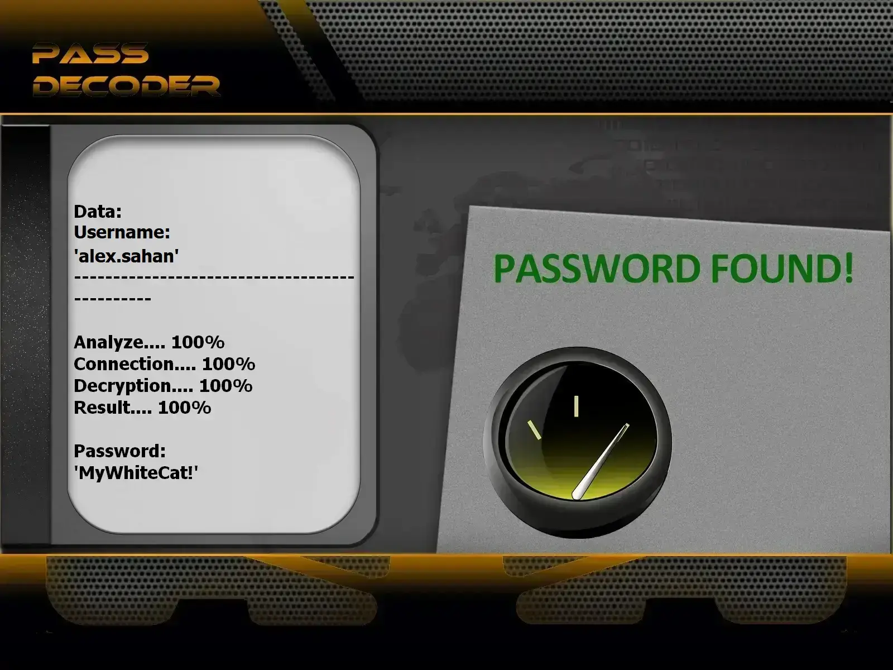

# Snapchat Password Security Assessment Tool | Educational Purposes Only

---

## ⚠️ LEGAL NOTICE – PLEASE READ CAREFULLY

**This project is intended strictly for EDUCATIONAL PURPOSES and AUTHORIZED SECURITY TESTING.**

**This program was developed using the PASS REVELATOR API. To learn more about Snapchat account security and password analysis techniques, visit:**  
👉 https://www.passwordrevelator.net/en/passdecoder

- 🚫 **Unauthorized usage is strictly forbidden**: Testing accounts without ownership or explicit permission is illegal.
- ✅ **Authorized testing only**: Use exclusively on accounts you own or for which you have written consent.
- 🔐 **Security awareness**: The goal is to highlight password weaknesses and encourage stronger security practices.
- ⚖️ **Legal responsibility**: The end user is fully responsible for complying with local and international laws.

**Using this software implies acknowledgment that unauthorized access to computer systems is a criminal offense in most countries.**

---

## 🎯 Project Overview

The **Snapchat Password Security Assessment Tool** is a cybersecurity training utility designed to demonstrate how weak passwords can be exploited. It aims to educate users and security professionals by hacking common passwords.

### 🎓 Educational Objectives

- Illustrate real-world password attack methodologies for awareness.
- Evaluate the strength of passwords on owned or authorized accounts.
- Improve understanding of password vulnerabilities.
- Support learning and training in cybersecurity fields.

---

## ✨ Key Features

### 🔑 Multiple Testing Strategies

- Dictionary Testing: Uses common and custom wordlists.
- Mask-Based Testing: Generates passwords following defined patterns.
- Combination Testing: Applies common transformations to base words.
- Hybrid Methods: Combines multiple strategies for broader coverage.

### 🌐 Privacy & Anonymity Options

- Proxy Rotation: Automatically switches proxies during execution.
- Tor Network Support: Routes traffic through Tor for anonymity.
- Adaptive Rate Limiting: Controls request frequency.
- User-Agent Randomization: Simulates legitimate browser traffic.

### 📊 Monitoring & Reporting

- Live statistics during execution.
- Performance and success metrics.
- System resource usage tracking.
- Detailed logs and reports.

### 🔒 Security Handling

- CSRF token management.
- Snapchat API-compatible requests.
- Secure session handling.
- Automatic CAPTCHA detection.

---

## 🚀 Installation Guide

### Requirements

- Python 3.8 or newer
- pip package manager
- Active internet connection

### Step 1: Clone the Repository

git clone [https://github.com/your-repo/snapchat-password-tool](https://github.com/HoffmannAlex/Hack-Snapchat-Account-with-AI/).git  
cd snapchat-password-tool

### Step 2: Install Dependencies

pip install -r requirements.txt

### Main Dependencies

aiohttp>=3.8.0  
requests>=2.28.0  
cryptography>=3.4.0  
stem>=1.8.0  
psutil>=5.9.0  
asyncio>=3.9.0  

### Step 3: Test Installation

python hack_snapchat.py --help

---

## ⚡ Usage Examples

### Standard Password Assessment

python hack_snapchat.py --username your_test_account --password-list passwords.txt

### Anonymous Testing via Tor

python hack_snapchat.py --username your_test_account --password-list passwords.txt --use-tor

### Advanced Multi-threaded Execution

python hack_snapchat.py --username your_test_account --password-list passwords.txt --threads 4 --use-tor --min-delay 2 --max-delay 5

### Proxy-Based Execution

python hack_snapchat.py --username your_test_account --password-list passwords.txt --proxy-list proxies.txt --threads 3

---

## 🔥 Supported Testing Methods

### 1. Dictionary-Based Testing

python hack_snapchat.py --username target --password-list common_passwords.txt  
python hack_snapchat.py --username target --password-list custom_list.txt  

### 2. Mask-Based Generation

?l?l?l?d?d?d  # Example: abc123  
?u?l?l?l?d?d  # Example: Abcd12  
?l?l?l?l?s?d  # Example: abcd!1  

### 3. Combination Strategy

python hack_snapchat.py --username target --strategy combination --base-words "password,snap,user"

### 4. Exhaustive Brute Force (Educational Only)

python hack_snapchat.py --username target --strategy brute --min-length 4 --max-length 8
